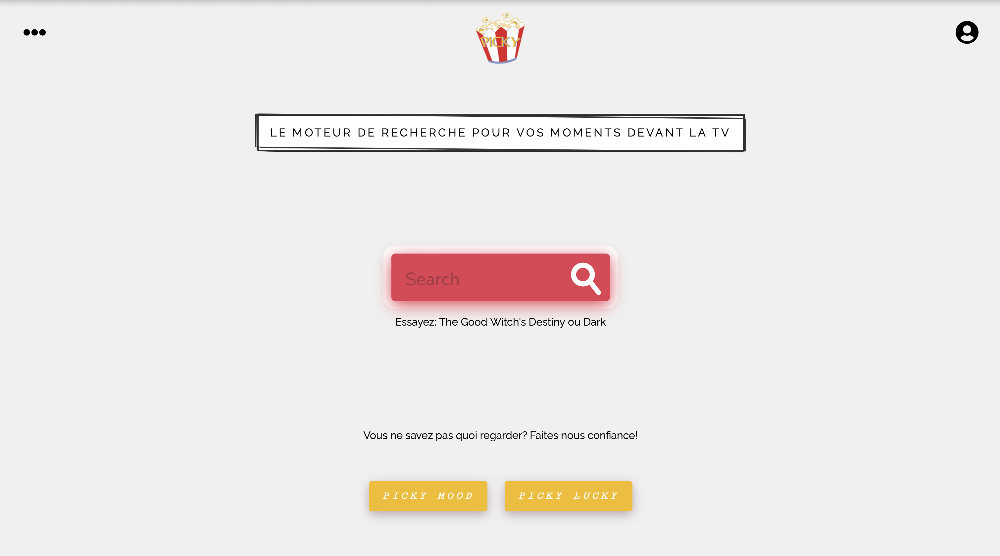

# Picky

Ce projet est une application web qui permet de trouver des films ou séries et de savoir sur quelle(s) plateforme(s) de streaming on peut les regarder. C'était un projet de fin de formation [O'Clock développeur Fullstack Javascript](https://oclock.io/formations/developpeur-web-fullstack-javascript) qui a duré 1 mois et que l'on a créé dans une équipe de 5 personnes, où mon rôle était Lead Dev Front.



## Technologies utilisées

- React.js
- Javascript
- Redux
- Node.js
- Express.js
- PostgreSQL
- Sqitch
- [API de BetaSeries](https://www.betaseries.com/api/)

## Installation

```
git clone https://github.com/Nina-petit/picky.git
cd projet-picky
cd front
npm install
npm start
```

## Fonctionnalités

- Profil: création d'un compte, modification des informations du compte, connexion via e-mail/mot de passe, suppression du compte
- Recherche d'un programme par titre ("Find")
- Recherche d’un programme par critères: type (film, séries), genre (comédie, romantique, horreur, etc), plateforme (Netflix, Amazon prime, Disney +, etc) ("Mood")
- Affichage d'un programme aléatoire ("Lucky")
- Ajout de programmes à une watchlist pour les retrouver plus tard
- Voir les détails d'un programme
- Mode sombre

## Fonctionnalités envisagées
- Ajout de critères par lesquels on peut rechercher un programme
- Gérer le visionnage d'un programme (cocher pour "vu")
- Compteur de J’aime sur un programme
- Associer un profil utilisateur à des plateformes
- Connexion via les réseaux sociaux
- Envoi de mail de vérification

## Contact et autres informations

- [Mon site personnel avec portfolio](https://nina-petit.herokuapp.com)
- [GitHub](https://www.linkedin.com/in/nina-petit-80b3b2190/)
- [LinkedIn](https://www.linkedin.com/in/nina-petit-80b3b2190/)